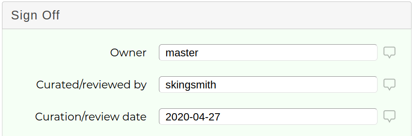
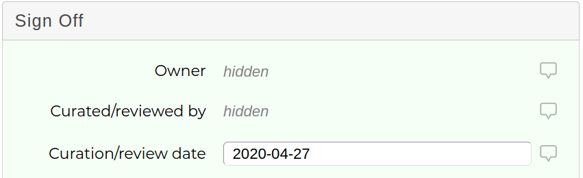

# Variant Classification Sharing

Shariant has the following concepts for handling who has access to what

|Body|Meaning|
|----|-------|
|Lab|Lab in an organisation (eg SA Pathology’s Familial Cancer, Frome Road) |
|Organisation|Aka Institution (eg SA Pathology, VCGS) |
|User|Each lab member should have their own login. The sync tool will have a separate account. |
|Variant Classification|A variant classification will be owned by a user and a lab |

A user can belong to multiple labs, though typically a user will only belong to one. Please contact us when a staff member leaves your lab and we can disable access to your lab's records.

Variant Classifications can be seen in two modes.

* The live editable copy
* A read-only version shared at a given point in time

If you or someone from your lab created a variant classification, you will be dealing with editable copy.
If someone from outside your lab shares a record with Shariant, you will be dealing with the latest published version of that record. If they make changes and share it again, you will then have access to the new version. The same applies when you share records with Shariant.

Users with access to the editable version can elect to share the record in its current state as long as there are no outstanding validation errors. This will give other users read only access to the data as it is when the publish action was performed.

Sharing can be done at several levels. Each level encompasses the level before it, and once it's shared at a certain level it can only be shared at that level or higher in future. The share levels are:

|Share Level|Who Can See|
|-----------|-----------|
|Lab|Will be available to the lab|
|Organisation|Every lab belonging to the institution/organisation that the owning lab belongs to can see this version|
|All Shariant Users|All Shariant users will be able to see this version|
|3rd Party Databases|This version is deemed ready to be exported to 3rd party databases such as Clinvar|

See the Sharing section in the API for information on how to utilise these share levels.

Just a reminder that the purpose of Shariant is to share records.

## Max share level

Some [evidence keys](../evidence_keys/overview.md) have a “max share level” and are never shared beyond that level, regardless of the overall classification share level.

For instance __curated_by__ and __curation_verified_by__ have a max share level of institution, which means only your users can see them. Users from other organizations can see the classification was from your lab, but not who did the curation.

**What your institute sees:**

**What others see:**

