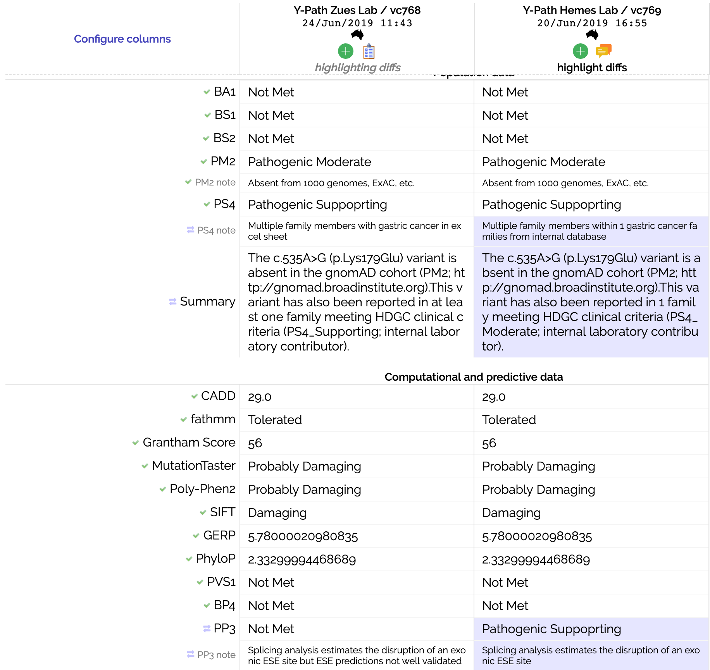

# Classification Diffs

The diff page allows you to compare several classifications, be it the history of a single classification or comparing classifications within a clincal group.

It is a handy tool for resolving discordances as you can see exactly what's different between the classifications.

Do note that different labs will be using different curation systems with different syncing abilities to Shariant - so there might be more data than is shown.

From the diff page, if you observe something worth discussing you can raise a suggestion flag against the classification in question.