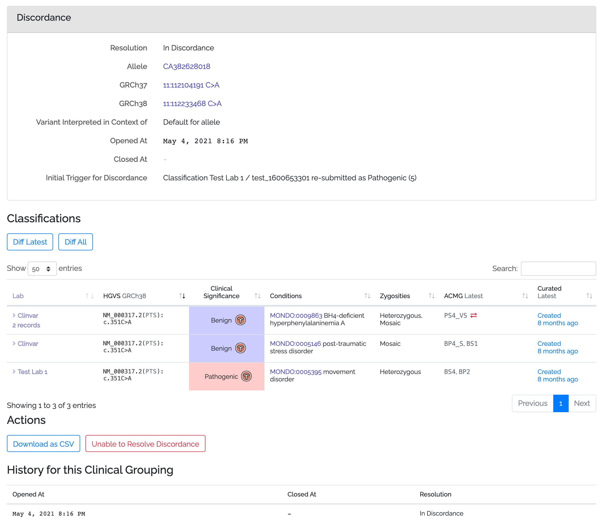

# Classification Discordance

## Terminology

### Allele
Shariant refers to "alleles" as a way to join logically equivalent variants in different builds together.

e.g. `GRCh37 1:40773150 G>A` is linked to the same allele as `GRCh38 1:40307478 G>A`.

Discordance is applied across genome builds on alleles, so if your lab is using GRCh37 and another lab is using GRCh38 and both labs have a classification that is logically referring to the same variant, then discordance calculations will consider both of those classifications together.

### Clinical Groups
Clinical groups are used to subdivide classifications within an allele. In many cases there will be only be one "default" clinical group for an allele, but in the following scenarios you might need to make new ones:
* The conditions between the classifications is significantly different (e.g. "Tietz syndrome" vs "Carpenter syndrome")
* The transcripts are significantly different

In most cases the "default" clinical group per allele will be sufficient.

### Discordance
Two (or more) classifications are considered discordant if they:
* Belong to the same allele
* Belong to the same clincal group within that allele (including the "default" clinical group)
* Are shared at the Shariant Users level or 3rd Party Database level
* Have clinical significances that fall into two or more of the following buckets (benign/likely benign), (VUS A/B/C), (likely pathogenic/ pathogenic), risk factor e.g. likely benign is discordant with VUS, but likely benign is concordant with benign.

Transcript & condition do not directly affect the calculation unless a human determines the differences in those values designate a different clinical group.

## Discordance... Now what?

So if one of your classifications meets the discordance criteria with another classification, what happens next?

## Discordance Report

A good place to start is the Discordance Report. The Discordance flag will provide you a link to get to here.

This shows you:
* When the discordance was first detected and the action that triggerd it
* The records that were involved at the start of this discordance
* The clinical significance & last curated date at the beginning of the discordance.
* The clinical significance & last curated date as they are now (or when the discordance was resolved if it has been)
* A summary of actions taken against each classification.

### Who's in Charge / Responsible

The owner of the classficaton that triggered the discordance is seen as the primary person in charge of resolving discordance. Note that this is not enforced in Shariant, anybody is free to take the lead resolving a discordance.

###  Internal Review

When discordance is first detected, it is recommended practice to perform an internal review of the classification (particularly if the classification hasn't been reviewed in the last 12 months).

You can raise an internal review flag in "In Progress" status and complete it later, or if you started and completed an internal review you can raise the flag as "Complete".
This will then show up in the report that an internal review has taken place.

If during your internal review, data is found that should be changed, please change the record in your curation system and the update will be applied the next time your data in synced with Shariant.

Note that you are welcome to record internal reviews in Shariant that were performed outside of a discordance being detected, though doing so is not required.

### Discordance Discussion

Once you've completed your internal review, you should investigate what evidence other labs have provided for the same variant.

The diff page is a good place to do this as it shows all the details of the classifications that are involved in the discordance discussion. (Diffs can be access from your classification, the discordance flag or the discordance report)

See details [About the Diff Page here](classification_diffs)

After reviewing details from another lab's classification, you can raise  "Suggestion" flags on their classifications. "Suggestion" flags are able to provide a means of communicating with another lab.

When reviewing the other lab's classification, keep in mind what flags have already been opened and closed e.g. they may have not yet completed an Internal Review or there might be some previously recorded accepted and rejected suggestions.
Also keep in mind that if a lab has agreed to make a change, it may take some time for that change to be synced back up to Shariant from the lab's curation system.

###  Change of Clinical Significance

As a result of an Internal Review, Suggestions or outside discussions you might decide to change your record's Clinical Significance (hopefully towards concordance).
Update this in your curation system and later this will be synced with Shariant. A flag is then automatically raised asking for the reason behind a change. That reason will be recorded against the Discordance Report.

### Concordance is Reached

If you or another lab:
* Change clinical significances so all the remaining classifications are in the same clinical significance bucket.
* Withdraw classifications that aren't in concordance. (see below)
* Sub-divide classifications into more meaningful groupings. (see below)
Then you will have reached concordance and the discordance and discordance report will automatically close. Congratulations.

### Withdrawing

If a classification that caused the discordance has been found to be an error and shouldn't be considered in its current form, the owner of the classification may mark it as Withdrawn from the classification form.

Withdrawn classifications are not considered during discordance calculations.
(It will still appear on the report, but will be struck out to indicate it is no longer considered.)

### Clinical Re-Groupings
If you determine you have two or more classifications that are discordant but for good reason, you can change the Clinical Grouping of the records.

For example, if a variation is Pathogenic for "Tietz syndrome" and benign for "Carpenter syndrome" you can divide classifications up into both.
To do so from the variant page, click "Change Clinical Grouping".

A column for clinical grouping will appear, any classifications that have the same text in that column will be considered in the same Clinical Grouping. Note that a Clinical Grouping is a free text name and the classifications that belong to it.

Once you've updated it so classificaitons have the appropriate groupings, hit save. This may resolve (or cause) outstanding discordances.

It is suggested that if you do subdivide records, that you don't leave any in the "default" grouping for that allele.

### Continued Discordance

If after internal reviews and discussion, you have been unable to reach concordance, navigate to the Discordance Report page.

From here you can click "Unable to reach concordance".
Please only do this as a last resort. Note that if there are any future changes to the Clinical Context (a new record is added or a record changes its significance) discordance will be re-opened.
