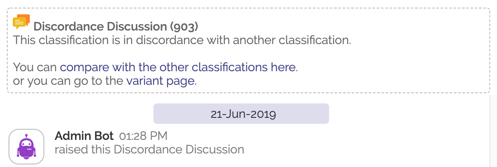

# Classification Discordance

## Terminology

### Allele
Shariant refers to "alleles" as a way to join logically equivilant variants in different builds together.

e.g. GRCh37 1:40773150 G>A is linked to the same allele as GRCh38 1:40307478 G>A.

Discordance is applied cross builds on alleles, so if you're lab is using GRCh37 and another is using GRCh38, if you're both logically referring to the same variant then discordance calculations will consider both of your classifications together.

### Clinical Groups
Clinical groups is used to subdivide classifications within an allele. In many cases there will be only be the one default clinical group for an allele, but in the following scenarios you might need to make new ones:
* The conditions between the classifications is significantly different (e.g. "Tietz syndrome" vs "Carpenter syndrome")
* The transcripts are significantly different

In most cases the "default" clinical group per allele will be sufficient. Sub-dividing more so into clinical groups should rarely be necessary.

### Discordance
Two (or more) classifications are considered discordant if they:
* Belong to the same allele
* Belong to the same clincal group within that allele (including the "default" clinical group)
* Are shared at the Shariant Users level or 3rd Party Database level
* Have clinical signifiances that fall into 2 or more of the following buckets (benign/likely benign), (VUS A,B,C), (likely pathogenic, pathogenic). e.g. likely benign is discordant with VUS, but likely benign is concordant with benign.
* (Transcript & condition do not directly affect the calculation - only if a human determines the differences in those values designate a different clinical group)

## Discordance... Now what?

So if one of your classifications meets the discordance criteria with another classification, what happens next?

###  Internal Review

When discordance is first detected, discorant classifications will have an "Internal Review" flag raised against them.
It is then up to someone from the lab to perform an internal review, update information in the source system for the classification (if required), and close the internal review flag.

The steps you take during an internal review are up to the discrecion of your lab.

Note if you've closed an internal review flag in the last 365 days you won't be asked to perform another one.

###  Discordance Discussion

At this point a flag will be raised asking you to discuss the discordance with the labs responsible for the other classifications. Shariant can facilitate this discussion.

If you open the flag it will provide some quick links to the corresponding variant page. From the variant page you will see classifications grouped by clinical group as well as seeing classifications from your lab or organisation not yet shared with all users.

The flag will also provide a link to the diff page, showing all the details of the classifications that are involved in the discordance discussion.

See details [About the Diff Page here](classification_diffs)

During the discussion phase have a look at the classifications you are discordant with. See if there's any relevant data that they've included that your lab may have missed. Likewise after reviewing details from their classification, you can raise  "Suggestion" flags on their classifications.

When reviewing the other classification, keep in mind what flags they already have open. If they have an "Internal Review" flag, they have not yet completed an internal review keep that in mind when looking at their data. They may already have some suggestions too.

### Concordance is Reached

If you or the other lab changes their clinical significance and resubmits so all the classifications in the same clinical significance bucket, then the discordance is ended. Congradulations.

If one of your classifications changed its clinical significance to reach concordance, your classification will be marked with a [Significance Changed](classification_flags) flag.

### Stuck in Discordance

If after internal reviews and discussion, you have been unable to reach concordance. Navigate to the variant page where you can see the listing of clinical contexts.
From here you can raise an "Unable to reach concordance" flag.

Important, raising the flag will stop all discordance discussion flags, please only do this when things are really stuck.

At this point a Shariant admin may initiate an expert review or contact you to attempt to resolve the discordance.