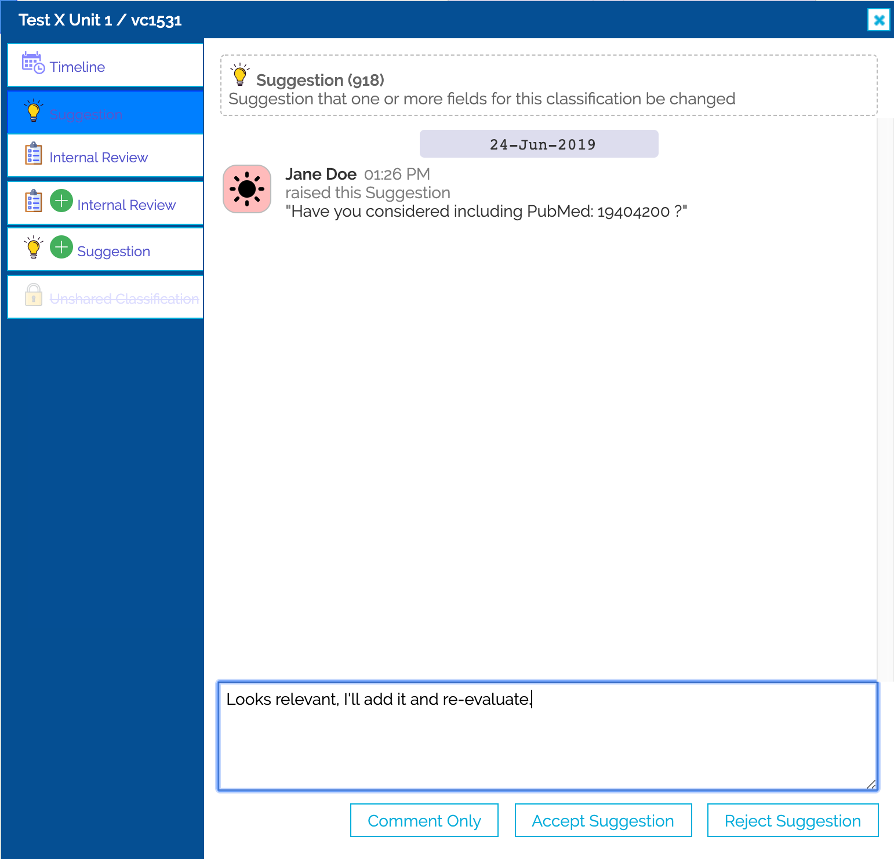

# Classification Flags

Each classification flag indiciates that there is an action that needs to be performed against the classification.

Many of the flags will be automatically raised by Shariant, though some of them you will be able to open yourself.

To look at the details of a specific open flag, simply click on it to be taken to the flag dialog.

## Flag Dialog

From the flag dialog you can look at the timeline of the classification and see who performed which actions when. On the timeline tab, there's also the ability to star a classification, which means it will be easy to find.

You can visit the details of an open flag, or a closed one (closed flags will be crossed out on the flag dialog tabs).

From the details page of an open flag, depending on the type of flag, you can add a comment and potentially close the flag.

You can raise a new flag by clicking on one of the tabs with a plus button.

(The kinds of actions you can take on flags will depend on if you're looking at a classification from your lab or another lab.)

See below for flags and how to solve them:

## Flag Types

###  Matching Variant
Shariant is processing the variant information from the upload of this classification. It should be automatically resolved, or turned into a matching failed if Shariant cannot process it.

###  Matching Variant Failed
Shariant was unable to normalise and resolve the variant information provided in the classification. The issue might be due to the sync process or it might be a special case that requires intervention.

At this stage all that can be done with such classification is to see if you can fix the sync process, delete the records as they are in Shariant and upload them again.

###  Unshared Classification
The classification is only being shared at the lab or organisation level. It is intended that all classifications in the Shariant system eventually be shared at the All Users or 3rd Party Databases level.

To fix, ensure that you are happy with the content of the classification and share it to the appropriate level.

###  Suggestion
Somebody has made a suggestion on one of your classifications.

Review the suggestion and take one of the following actions:
* Add a comment to continue the conversation.
* Click "Accept Suggestion" on the flag and make the appropriate data changes in your source system.
* Add a reason why and click "Reject Suggestion" on the flag.

###  Significance Changed
This classification has previously been submitted under a different classification than it is now. e.g. It has gone from Benign to Likely Benign, from VUS to Likely Pathogenic.
For our statistics, we would like to know what caused this change.

Open the flag, add any appropriate text and click the reason that best describes why the classification was changed.

###  Internal Review
This is discussed in the [Classification Discordance](classification_discordance) page.

###  Discordance Discussion
This is discussed in the [Classification Discordance](classification_discordance) page.
