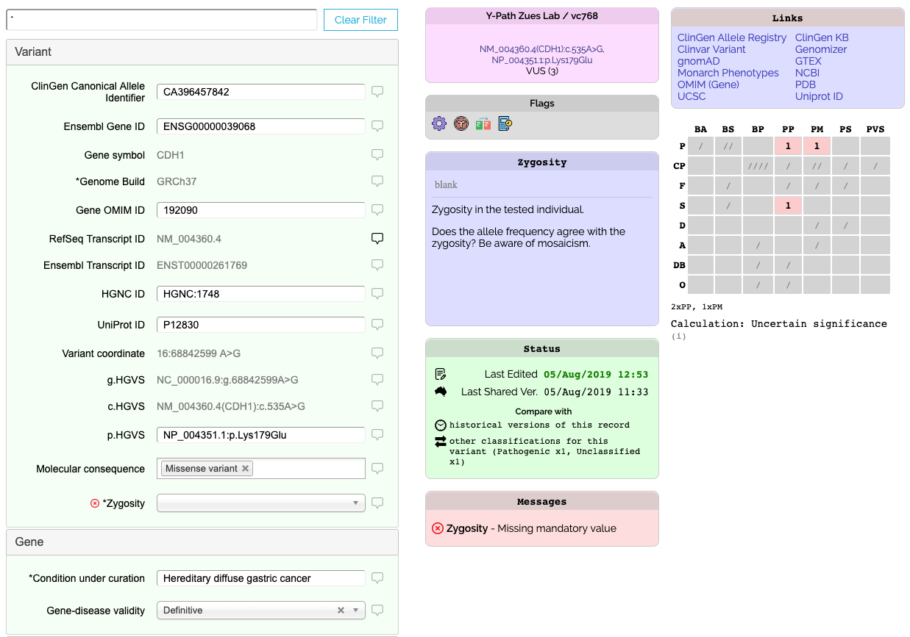
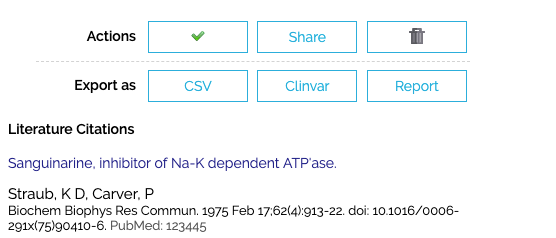

# Classification Form

The Classification Web Form can be used to create and edit classifications directly within Shariant.

However it is expeced that classifications be created in your own classification system, and automatically synced to Shariant.
That said, the Classification Web Form still provides some utility.

The web form provides a good readable version of Shariant's version of the web form.

### View

To quickly see all fields that have values for a classification, enter "*" into the filter box at the top of the classification.

If you're looking at one of your own records, if a value was provided by your curation system to Shariant connector, it will be read only. If there are values that are never uploaded, you can edit them directly on the form. (This would be a very time consuming process to do for all classifications so it's assumed it will only be done in special cases like discordances).

Note that for other users to see changes you have to perform a submit or share (see Actions).

You can also enter notes next to fields, be warned that if your connector to Shariant sends up notes, your notes might get overriden.

### Identify Errors

A record might not be shared as there are outstanding validation errors. In the Messages box on the form it will list any errors. If possible fix those errors in your curation system and then they should be fixed on the next sync.

### Change History / Diff

Each version of a record published in Shariant is recorded, by clicking on "Compare historical versions of this record".

If there are other classifications for the same variant, there will be a link to compare them there too.

### Actions

At the bottom of the form there will be a list of action buttons.

The Tick icon re-submits the classification at its current change level. For any manual changes to be seen, this button will need to be ticked.

Next to it is a Share button that allows you to increase the scope of who can see the classification.
Important, increasing the Share level is not un-doable.
The share levels are
* Just your lab
* Anyone within your organisation (if your organisation has multiple labs)
* All Shariant Users
* 3rd Party Databases (this will allow us to upload the record to Clinvar at a later date)

Delete / Withdraw

If the classification has only been shared at the lab or organisation level, you are able to perform a hard delete on the record.
If it has been shared, instead you have the option to "withdraw". This will remove the record from most listings and search results, but will not remove it from any Discordance Reports that it had been involved in (it will no longer be a part of discordance calculations).

When a record has been withdrawn it can be unwithdrawn by clicking the same button (it should look like a rubbish bin with a raised lid now).